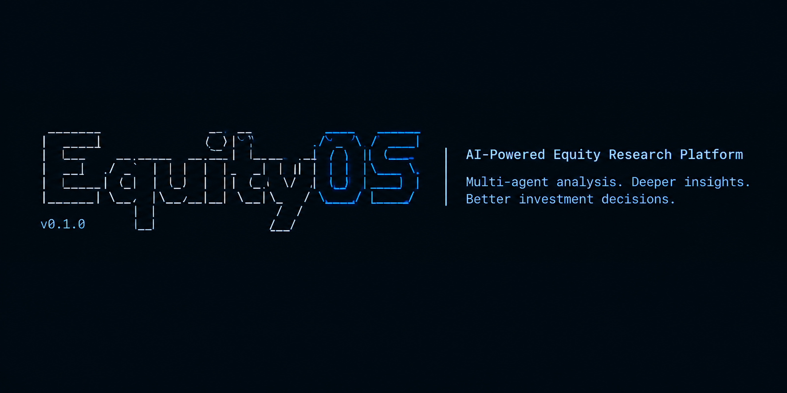
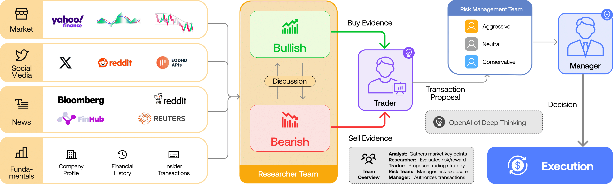
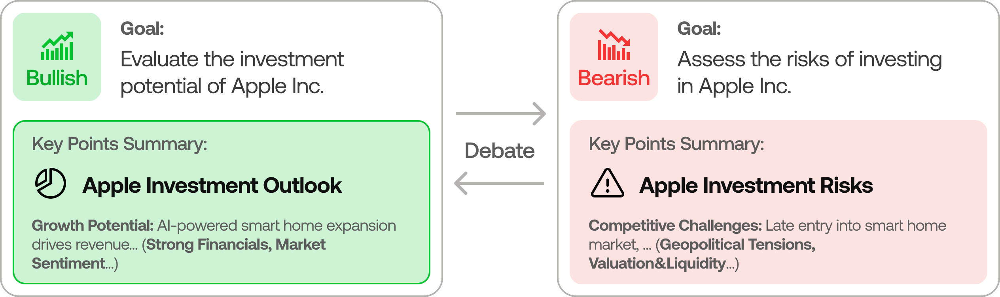
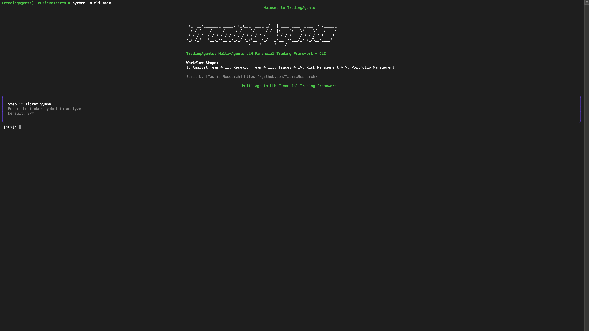
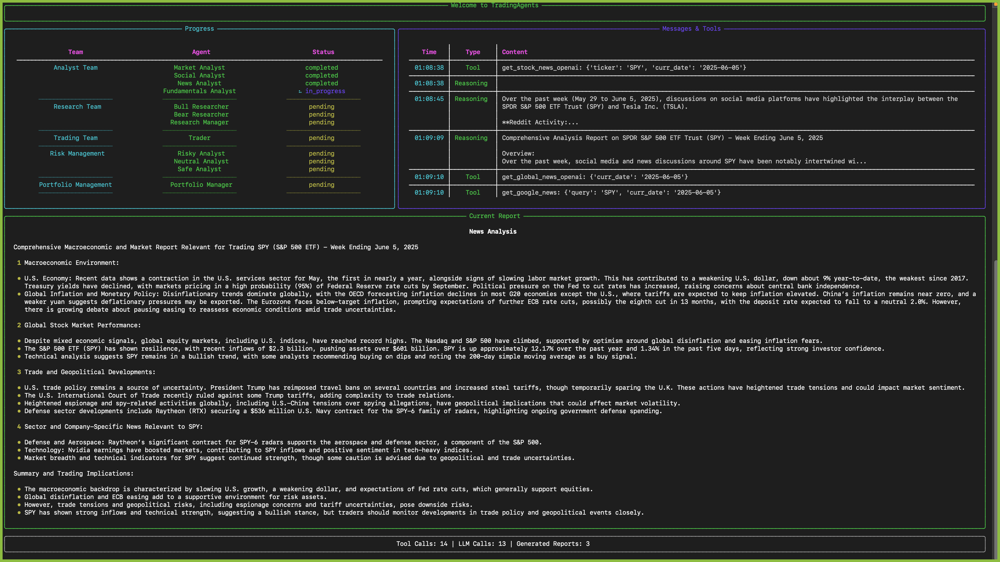

<p align="center">
  
</p>

# EquityOS: Multi-Agents LLM Financial Trading Framework

<div align="center" style="line-height: 1;">
  <a href="https://arxiv.org/abs/2412.20138" target="_blank"></a>
</div>

---

## News
- [2026-04] **EquityOS v0.2.4** released with structured-output agents (Research Manager, Trader, Portfolio Manager), LangGraph checkpoint resume, persistent decision log, DeepSeek/Qwen/GLM/Azure provider support, Docker, and a Windows UTF-8 encoding fix. See [CHANGELOG.md](CHANGELOG.md) for the full list.
- [2026-03] **EquityOS v0.2.3** released with multi-language support, GPT-5.4 family models, unified model catalog, backtesting date fidelity, and proxy support.
- [2026-03] **EquityOS v0.2.2** released with GPT-5.4/Gemini 3.1/Claude 4.6 model coverage, five-tier rating scale, OpenAI Responses API, Anthropic effort control, and cross-platform stability.
- [2026-02] **EquityOS v0.2.0** released with multi-provider LLM support (GPT-5.x, Gemini 3.x, Claude 4.x, Grok 4.x) and improved system architecture.
- [2026-01] **Trading-R1** [Technical Report](https://arxiv.org/abs/2509.11420) released.

<div align="center">

🚀 [Framework](#tradingagents-framework) | ⚡ [Installation & CLI](#installation-and-cli) | 📦 [Package Usage](#tradingagents-package) | 🤝 [Contributing](#contributing) | 📄 [Citation](#citation)

</div>

## TradingAgents Framework

TradingAgents is a multi-agent trading framework that mirrors the dynamics of real-world trading firms. By deploying specialized LLM-powered agents: from fundamental analysts, sentiment experts, and technical analysts, to trader, risk management team, the platform collaboratively evaluates market conditions and informs trading decisions. Moreover, these agents engage in dynamic discussions to pinpoint the optimal strategy.

<p align="center">
  
</p>

> EquityOS framework is designed for research purposes. Trading performance may vary based on many factors, including the chosen backbone language models, model temperature, trading periods, the quality of data, and other non-deterministic factors. It is not intended as financial, investment, or trading advice.

Our framework decomposes complex trading tasks into specialized roles. This ensures the system achieves a robust, scalable approach to market analysis and decision-making.

### Analyst Team
- Fundamentals Analyst: Evaluates company financials and performance metrics, identifying intrinsic values and potential red flags.
- Sentiment Analyst: Analyzes social media and public sentiment using sentiment scoring algorithms to gauge short-term market mood.
- News Analyst: Monitors global news and macroeconomic indicators, interpreting the impact of events on market conditions.
- Technical Analyst: Utilizes technical indicators (like MACD and RSI) to detect trading patterns and forecast price movements.

<p align="center">
  
</p>

### Researcher Team
- Comprises both bullish and bearish researchers who critically assess the insights provided by the Analyst Team. Through structured debates, they balance potential gains against inherent risks.

<p align="center">
  
</p>

### Trader Agent
- Composes reports from the analysts and researchers to make informed trading decisions. It determines the timing and magnitude of trades based on comprehensive market insights.

<p align="center">
  
</p>

### Risk Management and Portfolio Manager
- Continuously evaluates portfolio risk by assessing market volatility, liquidity, and other risk factors. The risk management team evaluates and adjusts trading strategies, providing assessment reports to the Portfolio Manager for final decision.
- The Portfolio Manager approves/rejects the transaction proposal. If approved, the order will be sent to the simulated exchange and executed.

<p align="center">
  
</p>

## Installation and CLI

### Prerequisites

- [uv](https://docs.astral.sh/uv/) — Python package and environment manager
- One or more LLM API keys (OpenAI, Anthropic, Google, etc.)

### Setup

```bash
git clone https://github.com/Siddhant-0519/EquityOS.git
cd EquityOS
uv sync
uv run tradingagents
```

This creates a `.venv`, installs all dependencies from `pyproject.toml`, and launches the interactive CLI.

### API Keys

Copy the example env file and fill in the keys for your chosen LLM provider:

```bash
cp .env.example .env
```

Supported providers: OpenAI, Anthropic, Google, xAI, DeepSeek, Qwen (DashScope), GLM (Zhipu), OpenRouter, Ollama (local), Azure OpenAI.

### Docker

```bash
cp .env.example .env  # add your API keys
docker compose run --rm tradingagents
```

For local models with Ollama:
```bash
docker compose --profile ollama run --rm tradingagents-ollama
```

### CLI Usage

```bash
uv run tradingagents     # launch interactive CLI
uv run python -m cli.main  # alternative
```
You will see a screen where you can select your desired tickers, analysis date, LLM provider, research depth, and more.

<p align="center">
  
</p>

An interface will appear showing results as they load, letting you track the agent's progress as it runs.

<p align="center">
  
</p>

<p align="center">
  
</p>

## TradingAgents Package

### Implementation Details

We built TradingAgents with LangGraph to ensure flexibility and modularity. The framework supports multiple LLM providers: OpenAI, Google, Anthropic, xAI, DeepSeek, Qwen (Alibaba DashScope), GLM (Zhipu), OpenRouter, Ollama for local models, and Azure OpenAI for enterprise.

### Python Usage

To use TradingAgents inside your code, you can import the `tradingagents` module and initialize a `TradingAgentsGraph()` object. The `.propagate()` function will return a decision. You can run `main.py`, here's also a quick example:

```python
from tradingagents.graph.trading_graph import TradingAgentsGraph
from tradingagents.default_config import DEFAULT_CONFIG

config = DEFAULT_CONFIG.copy()
config["llm_provider"] = "openai"         # openai, google, anthropic, xai, deepseek, qwen, glm, openrouter, ollama, azure
config["deep_think_llm"] = "gpt-5.4"      # Model for complex reasoning
config["quick_think_llm"] = "gpt-5.4-mini" # Model for quick tasks
config["max_debate_rounds"] = 2

ta = TradingAgentsGraph(debug=True, config=config)
_, decision = ta.propagate("NVDA", "2026-01-15")
print(decision)
```

Run with: `uv run python myscript.py`

See `tradingagents/default_config.py` for all configuration options.

## Persistence and Recovery

TradingAgents persists two kinds of state across runs.

### Decision log

The decision log is always on. Each completed run appends its decision to `~/.tradingagents/memory/trading_memory.md`. On the next run for the same ticker, TradingAgents fetches the realised return (raw and alpha vs SPY), generates a one-paragraph reflection, and injects the most recent same-ticker decisions plus recent cross-ticker lessons into the Portfolio Manager prompt, so each analysis carries forward what worked and what didn't.

Override the path with `TRADINGAGENTS_MEMORY_LOG_PATH`.

### Checkpoint resume

Checkpoint resume is opt-in via `--checkpoint`. When enabled, LangGraph saves state after each node so a crashed or interrupted run resumes from the last successful step instead of starting over. On a resume run you will see `Resuming from step N for <TICKER> on <date>` in the logs; on a new run you will see `Starting fresh`. Checkpoints are cleared automatically on successful completion.

Per-ticker SQLite databases live at `~/.tradingagents/cache/checkpoints/<TICKER>.db` (override the base with `TRADINGAGENTS_CACHE_DIR`). Use `--clear-checkpoints` to reset all of them before a run.

```bash
tradingagents analyze --checkpoint           # enable for this run
tradingagents analyze --clear-checkpoints    # reset before running
```

```python
config = DEFAULT_CONFIG.copy()
config["checkpoint_enabled"] = True
ta = TradingAgentsGraph(config=config)
_, decision = ta.propagate("NVDA", "2026-01-15")
```

## Contributing

We welcome contributions from the community! Whether it's fixing a bug, improving documentation, or suggesting a new feature, your input helps make this project better.

Past contributions, including code, design feedback, and bug reports, are credited per release in [`CHANGELOG.md`](CHANGELOG.md).

## Citation

Please reference our work if you find *TradingAgents* provides you with some help :)

```
@misc{xiao2025tradingagentsmultiagentsllmfinancial,
      title={TradingAgents: Multi-Agents LLM Financial Trading Framework}, 
      author={Yijia Xiao and Edward Sun and Di Luo and Wei Wang},
      year={2025},
      eprint={2412.20138},
      archivePrefix={arXiv},
      primaryClass={q-fin.TR},
      url={https://arxiv.org/abs/2412.20138}, 
}
```
